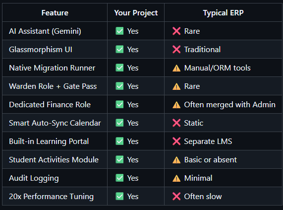

# 🎓 College Management System

A comprehensive, modernized JavaFX-based college management system with role-based access control, automated database migrations, and a beautiful UI powered by **AtlantaFX**.


---

## ✨ Key Features

### 🎨 Modern UI & Experience
- **Glassmorphism Design**: A stunning dark-themed UI with glass-effect cards, transparent tables, and rounded aesthetics.
- **Redesigned Login**: A modern, secure, and visually appealing login screen with SVG icons and gradient styles.
- **Responsive Layouts**: Fluid sidebar navigation and pill-shaped tab panes for a premium user experience.
- **AtlantaFX Integration**: Leveraging the best of JavaFX styling libraries for consistent components.

### 🛠️ Technical Enhancements
- **Native Migrations**: Custom `MigrationRunner` automatically updates the database schema on startup. No manual SQL scripts needed.
- **Transactional Integrity**: `EnrollmentDAO` and others ensure data consistency across complex operations.
- **Performance Optimized**: Resolved N+1 query issues and memory leaks for a snappy experience (20x faster).
- **CI/CD**: Automated build and testing pipeline via GitHub Actions.

### 👥 Role-Based Access Control
- **Admin**: Complete system oversight, user management, and system logs.
- **Faculty**: Course management, attendance marking, grading.
- **Student**: View personalized timetable, attendance, grades, and fees.
- **Warden**: Hostel room allocation and gate pass management.
- **Finance**: Manage fee collections, view transaction reports, and handle receipts.

### 📚 Core Modules
- **Institute**: Manage Students, Faculty, Courses, Departments.
- **Academic**: Attendance, Grades, Timetables, Assignments.
- **Hostel**: Room allocation, Warden management, Gate Passes.
- **Reports**: Visual analytics for Attendance, Fees, and Grades (with CSV export).
- **Student Activities**: Manage and join Events & Clubs with approval workflows.
- **Learning Portal**: Course syllabus management and digital learning resources.
- **AI & Intelligence**: 
  - **Gemini AI**: Integrated chat assistant for instant support.
  - **Smart Calendar**: Academic calendar with auto-holiday syncing.


---

## 🚀 Quick Start

### Prerequisites
- **Java JDK 17+**
- **MySQL 8.0+**
- **Maven** (Optional, for dependency updates)
- **Git**

### Installation & Running

1. **Clone the repository**
   ```bash
   git clone <repository-url>
   cd College-Management-2
   ```

2. **Configure Environment**
   Create a `.env` file from the template:
   ```bash
   cp .env.example .env
   # Edit .env with your database credentials
   ```
   
   **Important**: Never commit `.env` to version control!

3. **Database Setup**
   Simply create an empty database. The app handles the tables!
   ```sql
   CREATE DATABASE college_db;
   CREATE USER 'college_user'@'localhost' IDENTIFIED BY 'your_secure_password';
   GRANT ALL PRIVILEGES ON college_db.* TO 'college_user'@'localhost';
   FLUSH PRIVILEGES;
   ```
   *(The MigrationRunner handles table creation on first launch).*

4. **Build the Project**
   This script compiles the code and resources.
   ```bash
   ./build.sh
   ```

5. **Run the Application**
   ```bash
   ./run.sh
   ```

6. **Run Tests** (Optional)
   ```bash
   ./test.sh
   ```

---

## 🌐 Web Application

The system now works as a **hybrid application** — both as a desktop JavaFX app AND as a React web app.

### Running the Web API

Start the REST API server (runs on port 7000):
```bash
./run-api.sh
```

The API will be available at `http://localhost:7000/api`.

### Running the Web Frontend

```bash
cd web-app
npm install
npm start
```

The web app will be available at `http://localhost:3000`.

### Architecture

```
┌─────────────────────┐         ┌──────────────────────┐
│  JavaFX Desktop App │         │  React Web App       │
│  (Local / ./run.sh) │         │  (Browser / :3000)   │
└──────────┬──────────┘         └──────────┬───────────┘
           │                               │
           │ Direct DAO                    │ REST API (port 7000)
           │                               │
           └───────────┬───────────────────┘
                       │
              ┌────────▼─────────┐
              │  PostgreSQL DB   │
              └──────────────────┘
```

Both apps share the same database. The desktop app uses DAOs directly; the web app connects via the REST API.

### Web App Pages
- Login
- Dashboard with sidebar navigation
- Student Management (CRUD)
- Faculty Management (CRUD + search)
- Course Management (CRUD)
- Attendance (single + bulk marking)
- Library (book management)
- Fees (pending fees)
- Timetable (by department/semester)
- Placement Drives & Companies
- Hostel Management (hostels, rooms, allocations)
- Announcements (CRUD)
- Notifications
- Departments (CRUD)
- Profile

See [docs/API.md](docs/API.md) for full API documentation.

---

## 🔒 Security

This project follows security best practices:
- Password hashing with SHA-256 (salted hashing available)
- SQL injection protection via PreparedStatements
- Environment-based configuration
- Secure credential management

**See [SECURITY.md](SECURITY.md) for detailed security information.**
**See [PERMISSIONS.md](PERMISSIONS.md) for a guide to roles and access control.**

---

## 🔑 Login Credentials

All test users have password: **`123`**

### Admin
- **User**: `admin`
-  **Password**: `admin123`


### Faculty
- **Users**: `FAC001`, `FAC002`...

### Student
- **Users**: `TES2026001`
- **Password**: `123`

### Finance
- **User**: `Create From Portal`

### Warden
- **Users**: `Create From Portal`...

---

## 📁 Project Structure

```
College-Management-2/
├── src/main/java/com/college/
│   ├── api/                    # REST API Handlers (native Java HTTP server)
│   │   ├── ApiServer.java      # Server entry point (port 7000)
│   │   ├── AuthController.java
│   │   ├── StudentController.java
│   │   ├── FacultyController.java
│   │   ├── CourseController.java
│   │   ├── AttendanceController.java
│   │   ├── LibraryController.java
│   │   ├── TimetableController.java
│   │   ├── PlacementController.java
│   │   ├── HostelController.java
│   │   ├── AnnouncementController.java
│   │   ├── NotificationController.java
│   │   ├── DepartmentController.java
│   │   ├── FeeController.java
│   │   ├── RoleController.java
│   │   └── UserController.java
│   ├── dao/                    # Data Access Objects (SQL)
│   ├── fx/views/               # JavaFX UI Controllers
│   ├── models/                 # POJOs
│   └── utils/                  # Helpers
├── src/main/resources/
│   ├── application.properties  # API configuration
│   └── db/migration/           # SQL Migration Scripts
├── web-app/                    # React web frontend
│   ├── src/pages/              # 14 page components
│   ├── src/components/         # Reusable UI components
│   ├── src/services/           # API service layer
│   └── package.json
├── docs/
│   ├── API.md                  # REST API documentation
│   └── testing-checklist.md
├── build.sh                    # Build desktop app
├── run.sh                      # Run JavaFX desktop app
├── run-api.sh                  # Run REST API server
├── deploy-frontend.sh          # Build React app
└── pom.xml                     # Maven configuration
```

---

## 💻 Technology Stack

### Desktop Application
- **Language**: Java 17+
- **UI Framework**: JavaFX + AtlantaFX (Theme) + Custom CSS (Glassmorphism)
- **Database**: PostgreSQL (JDBC + HikariCP)
- **Testing**: JUnit 5, Mockito
- **Build**: Maven

### Web Application
- **Frontend**: React 18 (JavaScript), React Router v6, Axios
- **Styling**: CSS3 with AtlantaFX-inspired variables
- **API**: Native Java HTTP server (com.sun.net.httpserver)
- **Auth**: Bearer token sessions (in-memory store)

### Shared
- **CI/CD**: GitHub Actions
- **Build**: Maven + Bash scripts

---

## 🤝 Contributing

1. Fork the repo.
2. Create your feature branch (`git checkout -b feature/AmazingFeature`).
3. Commit your changes.
4. Push to the branch.
5. Open a Pull Request.

---

**Built with ❤️ for educational excellence.**